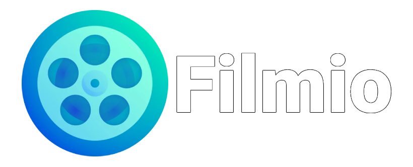

# Filmio - a MERN stack portfolio Web App

Сървърът на който е хостнат проекта спира след 30 минути липса на активност, за това при първо влизане в сайта трябва да се изчака известно време за да заредят статиите. 

Логнете се с предоставените по-долу имейл и парола за да имате достъп до пълната функционалност на сайта.

The backend server throttles down after a 30 minute inactivity period so for the first-time visit you will see a longer than normal loading time for the articles.

- Link: [filmio-site.vercel.app]()
- Account for visitors: email: visitor@admin.com / pass: visitoradmin101

This portfolio project has been built with ReactJS + Vite, Typescript, MongoDB, Express

Uses Vercel for hosting the front-end. 
MongoDB for handling the user, article and comment data on the back-end.
Firebase for hosting article and user images.

Supports:
- Article creation, updating and deleting.
- Article commenting, deletion and comment likes.
- Search functionality with the ability to filter by article title, category and to sort by article date.
- Dark Theme.
- User accounts. Creation, updating account details. Account can be created with OAuth or a regular email address.
- Admin dashboard and general functionality. All articles can be edited or deleted. All user comments can be deleted by admin.

